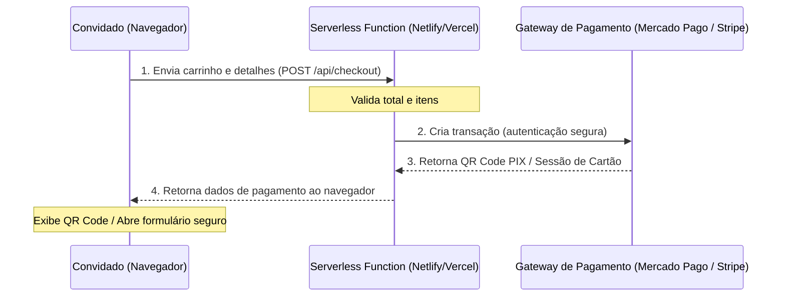

# Planejamento: Pagamento Efetivo e Funcional

Para tornar a compra de presentes simbólicos funcional e ativa, precisamos conectar o front-end atual a um mecanismo de processamento real. Abaixo estão as três principais abordagens recomendadas para este tipo de site stático.

---

## 📋 Opções de Integração

### Opção 1: Integração com WhatsApp (Sem Custos e Mais Utilizada)
* **Como funciona**: Ao finalizar a compra, o site gera uma mensagem personalizada e direciona o convidado diretamente para o WhatsApp do casal ou dos padrinhos com os dados do presente e a chave PIX.
* **Vantagens**:
  - Sem taxas de intermediação (0%).
  - Configuração imediata sem necessidade de servidores ou APIs de pagamento.
  - Mantém o contato próximo e caloroso com os convidados.
* **Esforço**: Baixíssimo (apenas ajustes no front-end JS).

### Opção 2: Integração com Mercado Pago (Automatizada via PIX e Cartão)
* **Como funciona**: O convidado gera o PIX e o QR Code oficial no site e, ao pagar, o sistema detecta a transação e exibe a tela de sucesso automaticamente. Também permite o fluxo de cartão de crédito.
* **Vantagens**:
  - Emissão de QR Code PIX dinâmico (com expiração automatizada).
  - Cobrança automatizada e segura no cartão.
  - Taxas amigáveis para transferências e saques no Brasil.
* **Esforço**: Médio/Alto (necessita de um pequeno backend serverless, como Netlify Functions ou Vercel Serverless, para esconder as credenciais secretas da API do Mercado Pago).

### Opção 3: Stripe Checkout (Fácil Integração de Cartões)
* **Como funciona**: O convidado é redirecionado para uma página segura hospedada pela própria Stripe para inserir os dados do cartão de forma totalmente segura.
* **Vantagens**:
  - Altíssima segurança (PCI DSS) e taxas claras.
  - Suporta cartões internacionais de forma exemplar.
  - Configuração simplificada de Webhooks.
* **Esforço**: Médio (também necessita de um serviço backend/serverless para criar a sessão de pagamento).

---

## 🛠️ Arquitetura Técnica Recomendada (Para Opções 2 e 3)

Como o site atual é **100% estático** (HTML puro + CSS + JS), não podemos colocar chaves privadas de pagamento diretamente no código do navegador, pois seriam expostas publicamente.

A solução clássica é usar uma arquitetura Jamstack com **Serverless Functions**:

---

## 🚀 Próximos Passos Sugeridos

1. **Definição da Abordagem**: Qual das opções acima faz mais sentido para o orçamento e a necessidade prática do casal?
2. **Setup de Contas**: Se optarmos por gateway, precisaremos criar uma conta de teste (Sandbox) no Mercado Pago ou Stripe.
3. **Desenvolvimento do Endpoint**: Criar a API serverless de checkout para processamento.
4. **Homologação e Testes**: Fazer transações simuladas antes de colocar a chave de produção.
